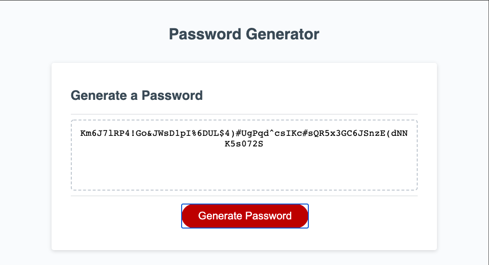

# passwordGenerator

A random password generator built using JavaScript.
When clicking on the Generate Password button, you given a series of promps. After completing the promps a randomly generated password will print to the screen.

Live code link is viewable at https://levickane.github.io/passwordGenerator/
